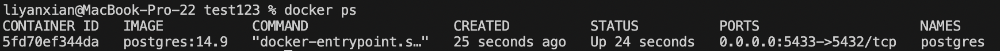
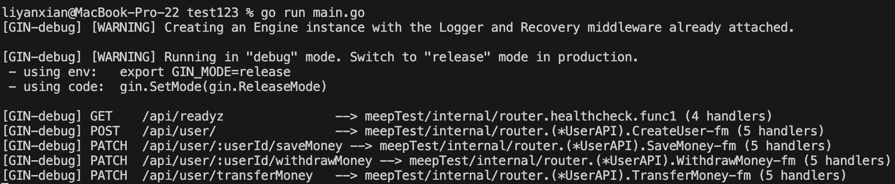
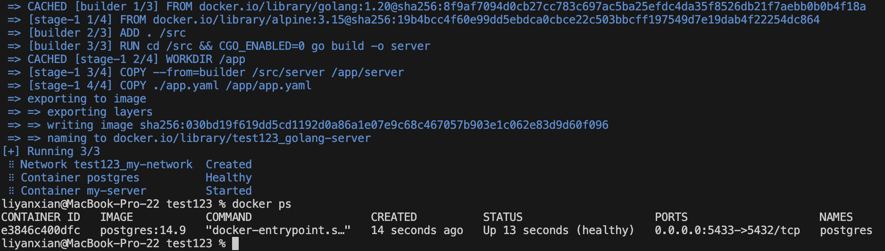
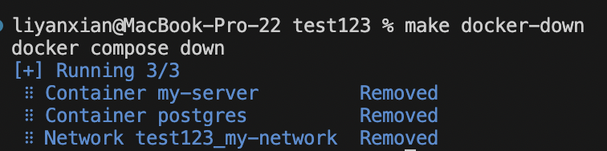

## how to run
### DB (use docker)
第一步一定要先有db，不然後端在run起來的時候連線會一直失敗，所以這步一定要先執行(這邊包含在db建立測試資料)  
`make docker-up-db`  

### server
確定db有run起來後(不論是否使用docker都可以，就可以執行下面這段)  
`go run main.go` or  `make run`  

## how to test api 
可以用postman import meepShop.postman_collection.json,原則上有執行過`make docker-up-db`就可以直接用裡面的api測試  

## how to run server and DB
### use docker compose
`make docker-up`  

### hot to server and DB 
`make docker-down`

## how to test
`make test`
